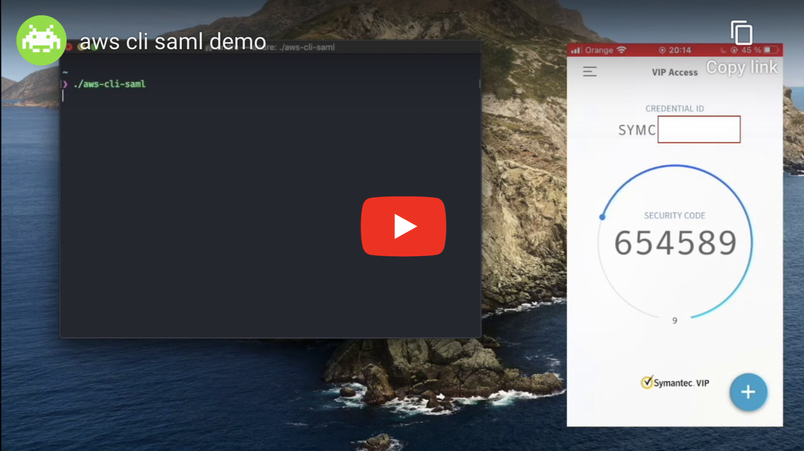

# aws-cli-saml-headless-symantecvip

Get temporary AWS CLI credentials via STS Assume Role w/ SAML using token retrieved via Enterprise Symantec VIP MFA login.

[](https://youtu.be/AwgIBYWUvMc)

## Usage
```sh
$ aws-cli-saml <input>

Arguments
    help            Shows this help message.
    configure       Initiates configuration flow.

Options
    --role, -r      IAM Role name or arn to be used for authentication.

    --duration, -d  Duration of temporary credentials in seconds.

    --advanced      Presents additional settings during configuration flow.

    --verbose       Enables verbose logging for troubleshooting.

Examples
    $ aws-cli-saml
    $ aws-cli-saml --role my_role_name
    $ aws-cli-saml --role arn:aws:iam::123456789101:role/my_role_name
    $ aws-cli-saml --duration 10800

    $ aws-cli-saml configure
    $ aws-cli-saml configure --advanced

    $ aws-cli-saml --verbose
```

## Further readings
* [AWS Docs - About SAML 2.0-based Federation](https://docs.aws.amazon.com/IAM/latest/UserGuide/id_roles_providers_saml.html)
* [AWS Docs - Enabling SAML 2.0 Federated Users to Access the AWS Management Console](https://docs.aws.amazon.com/IAM/latest/UserGuide/id_roles_providers_enable-console-saml.html)
* [AWS Docs - Configuring SAML Assertions for the Authentication Response](https://docs.aws.amazon.com/IAM/latest/UserGuide/id_roles_providers_create_saml_assertions.html)
* [AWS Docs - AssumeRoleWithSAML](https://docs.aws.amazon.com/STS/latest/APIReference/API_AssumeRoleWithSAML.html)